# <div align="center">🧬 MUHAMMAD EKRAMAH 🧬</div>

<div align="center">
  
</div>

<div align="center">
  
</div>

<div align="center">
  
  [](https://github.com/itsEkramah)
  
</div>

---

## 🔬 **About Me**

```python
class GenomeCodeArchitect:
    def __init__(self):
        self.name = "Muhammad Ekramah"
        self.location = "📍 Islamabad, Pakistan"
        self.education = "Advanced Bioinformatics Studies - Quaid-e-Azam University"
        self.field = "Computational Biology & Data Science"
        self.passion = ["Genomic Architecture", "ML-Driven Discovery", "Precision Medicine"]
        self.mission = "Decoding Life's Blueprint Through Data Science"
    
    def about_me(self):
        return """
        Currently engaged in advanced studies in bioinformatics, integrating computer science 
        and biology to navigate and analyze complex genetic datasets with a view toward 
        medical innovations. My primary objective is to deepen my expertise in bioinformatics 
        and apply this knowledge to areas such as personalized medicine and genetic research.
        
        Through rigorous coursework and independent projects, I continuously refine my skills 
        in machine learning and data analysis, particularly in predicting genetic patterns 
        and behaviors. Beyond academics, I actively pursue opportunities to collaborate with 
        peers and industry professionals, believing that shared insights and collective 
        problem-solving are key drivers of innovation in our field.
        """
    
    def daily_workflow(self):
        return [
            "☕ Morning: Coffee + Genomic Data Mining",
            "🧬 Afternoon: Sequence Analysis & Pattern Recognition", 
            "🤖 Evening: ML Model Training on Biological Data",
            "📊 Night: Molecular Interaction Visualization",
            "🔬 Always: Building Bridges Between Biology & Technology"
        ]
    
    def vision(self):
        return "Architecting the future of medicine through computational genomics"
```

---

## 🎯 **Academic Journey & Goals**

<div align="center">

| 🧬 **Bioinformatics** | 🤖 **AI/ML** | 🏥 **Medical Innovation** |
|:---:|:---:|:---:|
| Genomic Data Analysis | Deep Learning Models | Personalized Medicine |
| Protein Structure Prediction | Neural Networks | Drug Discovery |
| Phylogenetic Analysis | Clustering Algorithms | Disease Prediction |

</div>

---

## 🛠️ **Technology Arsenal**

### **Programming Languages**
<div align="center">
  
</div>

### **Bioinformatics & Data Science Stack**
<div align="center">
  
  
  
  
  
</div>

### **Bioinformatics Tools**
<div align="center">
  
  
  
  
  
</div>

### **Database & Analysis**
<div align="center">
  
  
  
  
</div>

---

## 📊 **GitHub Analytics**

<div align="center">
  
### 🔥 **Contribution Streak**


### 📈 **Performance Metrics**


### 🌟 **Language Distribution**


</div>

---

## 🎨 **Contribution Graph**

<div align="center">
  
</div>

---

## 🏆 **GitHub Trophies**

<div align="center">
  
</div>

---

## 🐍 **Contribution Snake**

<div align="center">
  
</div>

---

## 💫 **Current Focus Areas**

```mermaid
graph TD
    A[🧬 Genomic Data] --> B[🤖 Machine Learning]
    B --> C[🏥 Medical Applications]
    C --> D[💊 Drug Discovery]
    C --> E[🎯 Personalized Medicine]
    A --> F[📊 Data Visualization]
    F --> G[🔬 Research Insights]
```



---

## 🌐 **Connect with Me**

<div align="center">
  
[](https://www.linkedin.com/in/muhammad-ekramah)
[](mailto:muhammadekramah786@gmail.com)
[](https://github.com/itsEkramah)

</div>

---

<div align="center">
  
### 🧬 *"Decoding life, one sequence at a time"* 🧬


</div>
